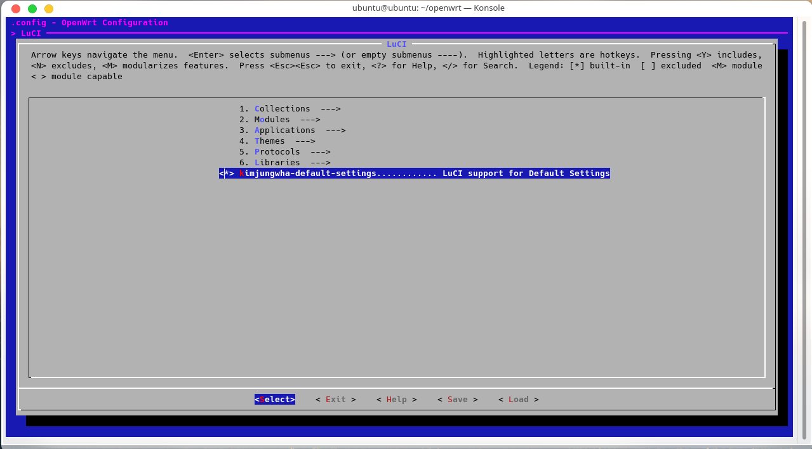

# KimJungWha-default-settings
> 基于 lean 大佬做的改版

### 修改内容
1. 源码主要结构如下

        tree -a
        .
        ├── files
        │   └── zzz-default-settings    # 配置脚本
        ├── Makefile
        ├── pictures
        │   └── menuconfig.png
        ├── po
        │   └── zh-cn                   # 附加的 luci 中文语言包
        │       ├── default.po
        │       └── more.po
        └── README.md

2. 对配置脚本进行了归类、并做了少许添加，如

        # --- luci 设置 ---

        # luci 语言设置
        uci set luci.main.lang=zh_cn  # 设置 luci 界面语言为中文
        uci commit luci  # 提交修改

        # --- 系统设置 --- 

        # 镜像源设置
        sed -i 's_downloads.openwrt.org_mirrors.aliyun.com/openwrt_' /etc/opkg/distfeeds.conf  # 将默认源改为阿里源
        sed -i "/oneko/d" /etc/opkg/distfeeds.conf       # 删除因 feeds 产生的无效仓库 oneko

        # --- 网络设置 --- 

        # lan 口地址设置
        sed -i 's_192.168.1.1_192.168.2.254_' /etc/config/network  # 默认地址设为 192.168.2.254

        # --- bug 修复 ---

        # 解决 mwan3 因找不到 ip 命令而无法启动的问题 
        # https://bugs.openwrt.org/index.php?do=details&task_id=1229
        ln -sf /sbin/ip /usr/bin/ip

### 如何使用 
- 将此软件包 clone 到 OpenWrt 源码根目录/package 下，如 

        cd ~/openwrt/package/
        git clone https://github.com/KimJungWha/default-settings 

- 在源码根目录下运行 menuconfig

        cd ~/openwrt
		make menuconfig

- Luci 分类下选中
    
    

- 编译即可
